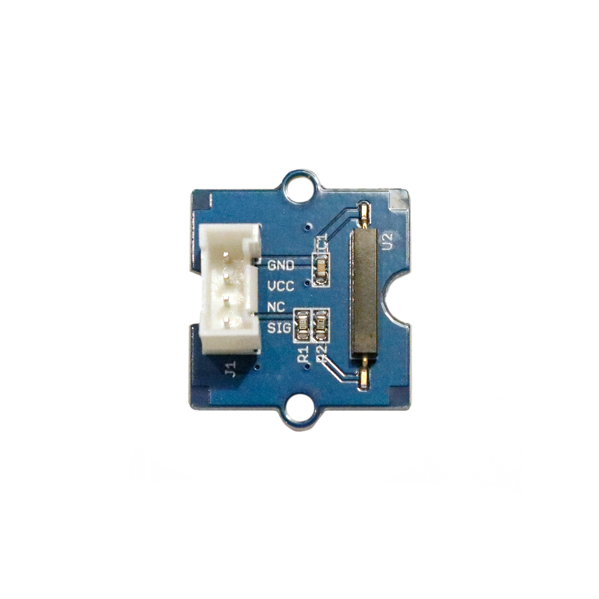

---
title: "Magnetschalter"
date: "2018-10-01T13:49:51.000Z"
tags: 
  - "sensor"
coverImage: "28_magnetschalter.jpg"
material_number: "28"
material_type: "sensor"
material_short_descr: "Seeed Studio Grove – Magnet Switch"
manufacture: "Seeed Studio"
manufacture_url: "https://www.seeedstudio.com/"
repo_name: "mks-SeeedStudio-Grove_Magnetic_Switch"
repo_prefix: "mks"
repo_manufacture: "SeeedStudio"
repo_part: "Grove_Magnetic_Switch"
product_url: "https://wiki.seeedstudio.com/Grove-Magnetic_Switch/"
clone_url: "https://github.com/Make-Your-School/mks-SeeedStudio-Grove_Magnetic_Switch.git"
embedded_example_file: "examples/Grove_Magnetic_Switch_minimal/Grove_Magnetic_Switch_minimal.ino"
---

# Magnetschalter

## Beschreibung
Der Magnetschalter funktioniert wie ein normaler Schalter und kann als Eingabe für einen Mikrocontroller verwendet werden. Der Sensor ermittelt, ob sich ein Magnet in seiner unmittelbaren Nähe befindet und gibt ein \[simple\_tooltip content='Digital vs. analog:

- Analoge Signale können beliebige kontinuierliche Werte annehmen. Sie verändern sich stufenlos. Dadurch können theoretisch unendlich viele kleine Änderungen (und damit ein unendlicher Informationsinhalt) übertragen werden. Einschränkend wirkt die Genauigkeit, mit der das analoge Signal ausgelesen/erfasst wird.
- Das digitale Signal nimmt nur diskrete Werte an und springt bei einer etwaigen Änderung von einem Wert zum nächsten. Es kann nur eine definierte Anzahl an Informationsinhalten übertragen werden. Vorteilhaft ist dagegen die damit verbundene Fehlerfreiheit bei minimalsten, ungewollten Schwankungen. Oftmals werden nur zwei Werte HIGH und LOW (Ein/Aus oder 1/0) übermittelt.

'\]digitales Signal\[/simple\_tooltip\] aus, sobald er sich in einem Magnetfeld befindet. Er kann direkt oder mithilfe des Grove Shields an einen Arduino oder Raspberry Pi angeschlossen werden. Der Schalter benötigt nur einen \[simple\_tooltip content='Die Mikrocontroller besitzen kleine metallische Kontakte, an die Komponenten, Shields oder andere Platinen angeschlossen werden können. Diese Kontakte werden Pins genannt und können oft als sogenannte GPIO’s (Allzweck Ein- und Ausgabe) eingesetzt werden. Dies bedeutet, dass diese Pins direkt über die Programmierung des Mikrocontrollers angesprochen werden können und hierbei sogar bestimmt werden kann, ob dieser Pin als Eingang (beispielsweise zum Auslesen eines Sensors) oder als Ausgang (beispielsweise zur Steuerung eines Motors) genutzt werden kann. Praktisches Beispiel: Wird am Arduino eine LED an Pin 1 angeschlossen, kann im Programm direkt der Pin 1 als „An“ oder „Aus“ definiert werden und damit die LED an- oder ausgeschaltet werden. '\]digitalen Pin\[/simple\_tooltip\].

Ein solcher Magnetschalter kommt beispielsweise in jedem Laptop zum Einsatz, um zu erkennen, ob dieser zugeklappt wird. Weiterhin kann der Sensor eingesetzt werden, um Systeme oder Geräte berührungslos nur mithilfe eines Magnets an- oder auszuschalten (oder andere Befehle per Magnet übertragen).

Alle weiteren Hintergrundinformationen sowie ein Beispielaufbau und alle notwendigen Programmbibliotheken sind auf dem offiziellen Wiki (bisher nur in englischer Sprache) von Seeed Studio zusammengefasst. Zusätzlich findet man über alle gängigen Suchmaschinen durch die Eingabe der genauen Komponentenbezeichnung entsprechende Projektbeispiele und Tutorials.

<!-- infolist -->

<!-- infolists -->
## Wichtige Links für die ersten Schritte:

- [Seeed Studio Wiki](http://wiki.seeedstudio.com/Grove-Magnetic_Switch/) [- Magnetschalter](http://wiki.seeedstudio.com/Grove-Magnetic_Switch/)

## Projektbeispiele:

- [Hackster - Türalarm mit Magnetschalter](https://www.hackster.io/iot-team-24/magnetic-reed-switch-door-alarm-103721) 

## Weiterführende Hintergrundinformationen:

- [GPIO - Wikipedia Artikel](https://de.wikipedia.org/wiki/Allzweckeingabe/-ausgabe)
- [GitHub-Repository: Magnetschalter](https://github.com/MakeYourSchool/28-Magnetschalter)

